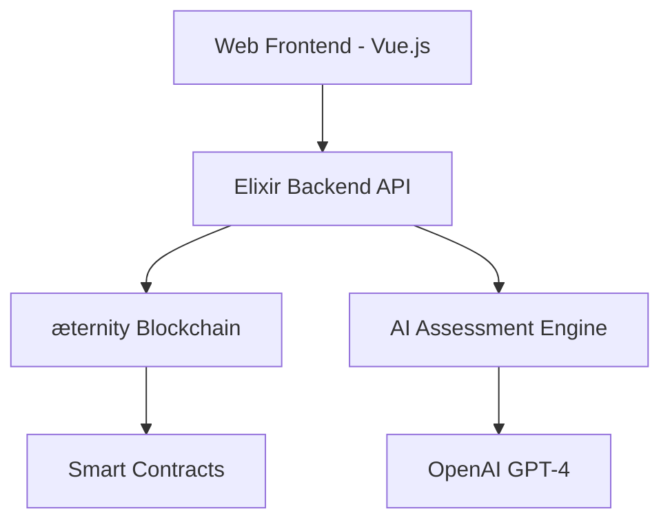

# SkillChain: AI-Powered Decentralized Learning & Certification Platform

## Overview
SkillChain is a decentralized application that combines AI-powered assessment, blockchain certification, and peer-to-peer learning. It allows users to:

1. Learn new skills through AI-curated content
2. Verify their skills through AI-powered assessments
3. Earn on-chain skill certificates as NFTs
4. Monetize their expertise by teaching others
5. Build reputation through verifiable credentials

## Technical Architecture



## Key Features

1. AI-Powered Skill Assessment
- Uses GPT-4 to evaluate submissions
- Provides detailed feedback and scoring
- Adapts assessment difficulty based on skill level

2. Blockchain Certification
- Issues verifiable certificates as NFTs
- Immutable proof of skills
- Transferable credentials

3. P2P Learning Marketplace
- Connect learners with experts
- Tokenized incentives for teaching
- Reputation system for instructors

4. Automated Course Generation
- AI creates personalized learning paths
- Dynamic content curation
- Progress tracking

## Innovation & Impact

1. Solves the problem of skill verification in remote work
2. Creates new earning opportunities through P2P learning
3. Reduces certification costs and increases accessibility
4. Provides transparent and verifiable credentials
5. Leverages AI for objective skill assessment

This dApp combines the strengths of æternity (smart contracts, state channels), AI (assessment, personalization), and Erlang/Elixir (scalable backend) to create a valuable platform for decentralized learning and certification.

### Smart Contracts

```sophia:contracts/SkillChain.aes
contract SkillChain =
  
  record state = {
    certificates : map(address, map(string, certificate)),
    instructors : map(address, instructor),
    courses : map(string, course)
  }
  
  record certificate = {
    skill_name : string,
    score : int,
    timestamp : int,
    issuer : address,
    metadata_url : string
  }
  
  record instructor = {
    reputation : int,
    earnings : int,
    students : list(address)
  }
  
  record course = {
    name : string,
    instructor : address,
    price : int,
    enrolled : list(address)
  }

  // Initialize contract
  stateful entrypoint init() = {
    certificates = {},
    instructors = {},
    courses = {}
  }

  // Issue new skill certificate
  stateful entrypoint issue_certificate(student: address, skill: string, score: int, metadata: string) =
    require(Call.caller == student || Map.member(Call.caller, state.instructors), "Unauthorized")
    let cert = {
      skill_name = skill,
      score = score,
      timestamp = Chain.timestamp,
      issuer = Call.caller,
      metadata_url = metadata
    }
    put(state{certificates[student][skill] = cert})

  // Register as instructor
  stateful entrypoint register_instructor() =
    require(!Map.member(Call.caller, state.instructors), "Already registered")
    let instructor = {
      reputation = 0,
      earnings = 0,
      students = []
    }
    put(state{instructors[Call.caller] = instructor})

  // Create new course
  stateful entrypoint create_course(name: string, price: int) =
    require(Map.member(Call.caller, state.instructors), "Not an instructor")
    let course = {
      name = name,
      instructor = Call.caller,
      price = price,
      enrolled = []
    }
    put(state{courses[name] = course})
```

### Elixir Backend

```elixir:lib/skill_chain/application.ex
defmodule SkillChain.Application do
  use Application

  def start(_type, _args) do
    children = [
      SkillChain.Repo,
      SkillChainWeb.Endpoint,
      {SkillChain.AI.AssessmentEngine, []},
      {SkillChain.Blockchain.ContractManager, []}
    ]

    opts = [strategy: :one_for_one, name: SkillChain.Supervisor]
    Supervisor.start_link(children, opts)
  end
end
```

```elixir:lib/skill_chain/ai/assessment_engine.ex
defmodule SkillChain.AI.AssessmentEngine do
  use GenServer
  
  def start_link(_) do
    GenServer.start_link(__MODULE__, %{}, name: __MODULE__)
  end

  def init(state) do
    {:ok, state}
  end

  def handle_call({:assess_skill, skill, submission}, _from, state) do
    # Connect to OpenAI API
    result = OpenAI.complete(%{
      model: "gpt-4",
      prompt: generate_assessment_prompt(skill, submission),
      max_tokens: 1000
    })

    case result do
      {:ok, assessment} ->
        {:reply, process_assessment(assessment), state}
      {:error, reason} ->
        {:reply, {:error, reason}, state}
    end
  end

  defp generate_assessment_prompt(skill, submission) do
    """
    Assess the following submission for #{skill} expertise level.
    Consider:
    1. Technical accuracy
    2. Problem-solving approach
    3. Best practices
    4. Code quality (if applicable)
    
    Submission:
    #{submission}
    
    Provide a score from 0-100 and detailed feedback.
    """
  end
end
```